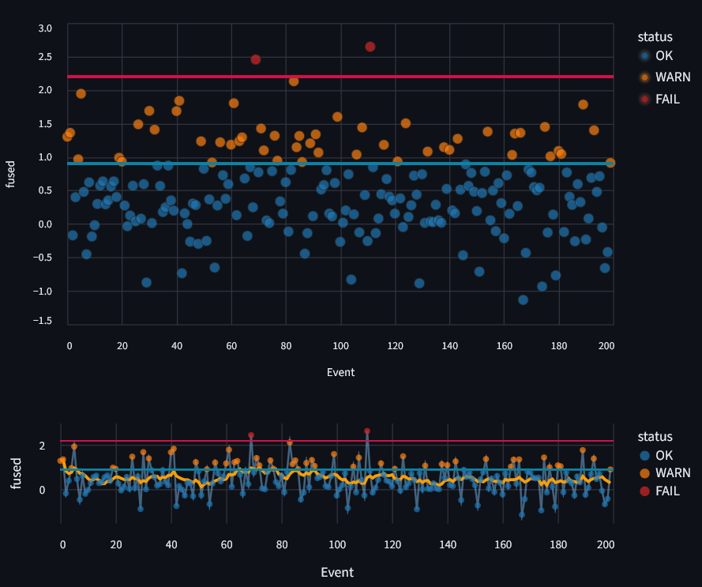
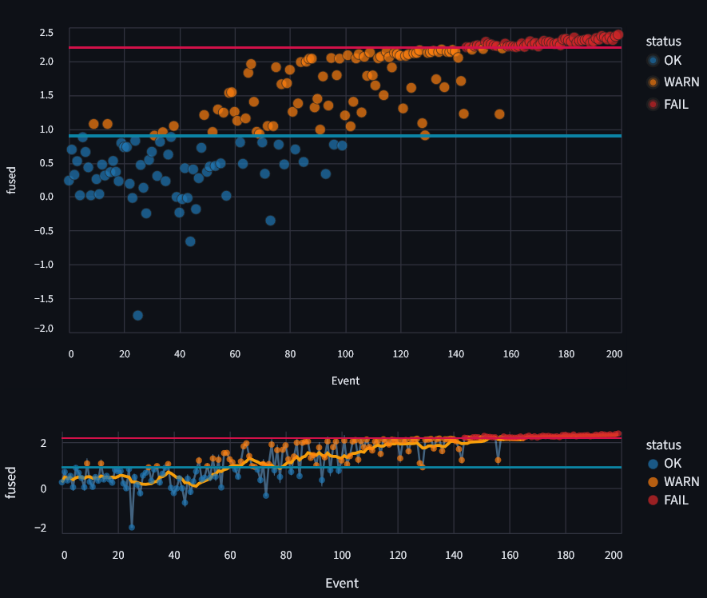
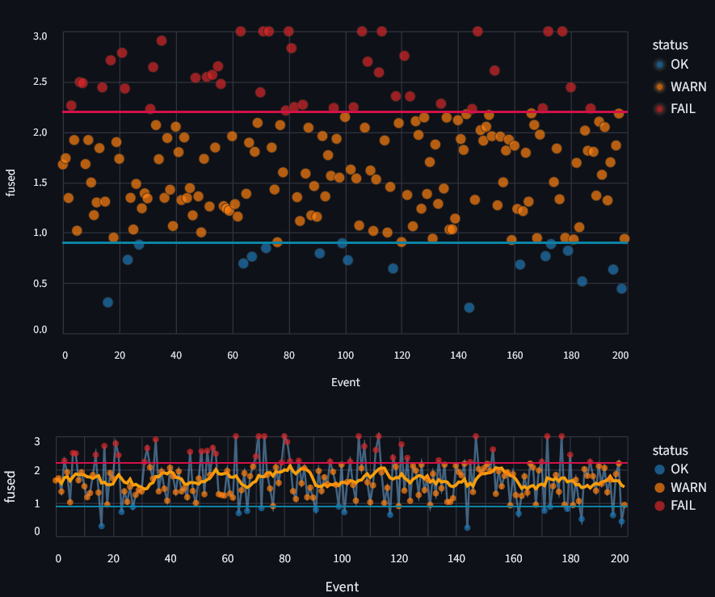
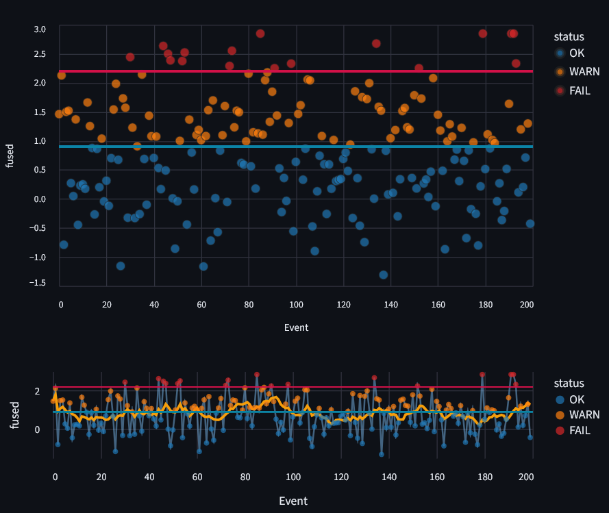

# MINI-SUPERVISOR: A Modular Architecture for Real-Time Drift Detection

**Author:** Hattie Lyons  
**Affiliation:** Loyola University Chicago — Department of Computer Science  
**DOI:** https://zenodo.org/records/17267058

---

## OVERVIEW

**Mini-Supervisor** is a modular, lightweight framework for detecting **semantic**, **statistical**, and **calibration drift** in real-time data streams.  
It provides a flexible architecture that integrates **embedding-based comparison**, **k-nearest neighbor classification**, and **calibration metrics** to flag deviations from a learned baseline.

Originally developed as part of a research poster for **US-RSE 2025**, this demo highlights the system’s adaptability across multiple domains, from experimental instrumentation to AI reliability monitoring.

---

## LIVE DEMO

Try the interactive version here:  
**[Streamlit Demo](https://mini-supervisor-demo.streamlit.app/)**  

You can toggle between **Signals**, **Text**, and **Image** adapters, adjust **thresholds** and **weights**, and simulate different drift modes such as `safe`, `drift`, `storm`, or `high_cal_drift`.

---

## ARCHITECTURE

The architecture is fully modular:

Incoming Data Stream → Adapter (domain-specific) → Baseline Store / Calibration → Supervisor Scoring → Fusion & Decision Logic → Optional: Storm Handling & Action Logic

Adapters (for signals, text, or images) simulate data streams, but in production settings these can be replaced by **live domain-specific data sources** (e.g., sensors, model embeddings, or logs).

---

## FEATURES

- **Modular design:** Easily swap adapters or scoring metrics.  
- **Real-time drift detection:** Stream data and visualize results live.  
- **Domain-agnostic:** Works with numeric, textual, and image-based data.  
- **Storm capping:** Optional calibration downweighting during sustained drift periods.  
- **Visualization-ready:** Built-in Streamlit charts for per-event drift inspection.

---

## RUNNING LOCALLY

Clone the repo:

git clone https://github.com/gravati/mini-supervisor-demo.git  
cd mini-supervisor

Create a virtual environment and install dependencies:

python -m venv venv  
source venv/bin/activate   # or venv\Scripts\activate on Windows  
pip install -r requirements.txt

Run the app:

streamlit run app.py

The app will open in your browser at `http://localhost:8501`.

---

## DEMO ADAPTERS

| Adapter | Description | Primary Drift Types |
|----------|--------------|---------------------|
| **SignalsAdapter** | Synthetic numeric stream using Gaussian noise and calibration EMD metrics. | Semantic, Calibration |
| **TextAdapter** | TF-IDF–based semantic stream using textual perturbations. | Semantic, Format |
| **ImageAdapter** | Grayscale histogram features with contrast/brightness drift. | Calibration, Visual |

Each adapter supports configurable run types:  
`default`, `drift`, `storm`, `high_cal_drift`, `high_semantic_drift`, `random`.

---

## KEY CONCEPTS

- **Semantic drift:** Change in meaning or topic distribution (embedding space).  
- **Calibration drift:** Instrumental or statistical shift in auxiliary distributions.  
- **Fused score:** Weighted combination of semantic and calibration z-scores.  
- **Storm mode:** Temporarily downweights calibration during sustained drift periods.

---

## EXAMPLE OUTPUTS

Sample drift runs showing transitions between `OK`, `WARN`, and `FAIL` states:

| Run Type | Description | Visualization |
|-----------|--------------|----------------|
| Default | Baseline, generally stable performance |  |
| Drift | Gradual semantic drift over time |  |
| High Calibration Drift | Constant calibration noise |  |
| Storm Mode | Drift recovery with calibration capping |  |

---

## MODULARITY / EXTENSIBILITY

The supervisor’s modular design allows for easy expansion:

- Add new **adapters** for domain-specific data (e.g., telemetry, genomics, logs).  
- Extend **metrics** beyond cosine or Mahalanobis (e.g., Jensen–Shannon divergence).  
- Integrate **automated action logic** for self-calibrating systems.

---

## CITATION / ACKNOWLEDGEMENTS

If you reference or use this work, please cite:

> Lyons, H. (2025). *A Modular Architecture for Detecting Data Drift in Research Systems.* Loyola University Chicago, Department of Computer Science.

Special thanks to the Loyola Systems & Software Lab and the US-RSE community.

---

## LICENSE

MIT License — see [LICENSE](LICENSE) for details.
